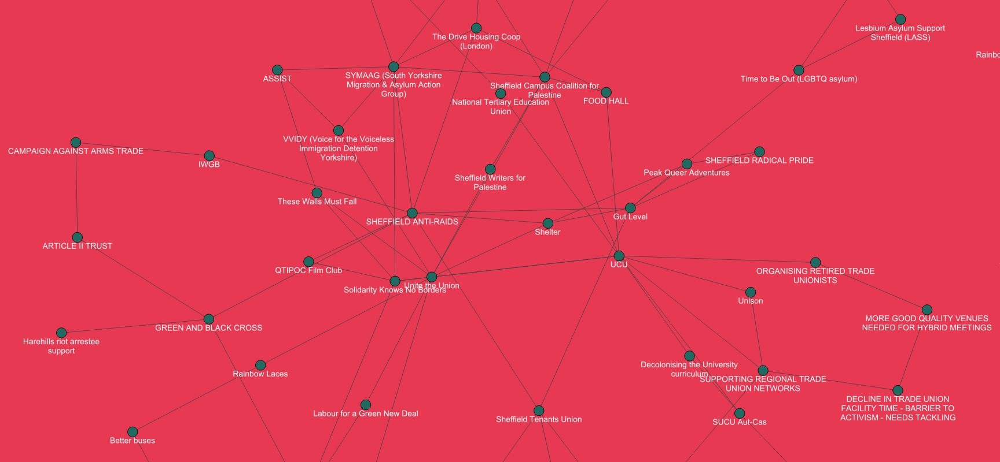

# Sheffield Transformed Graph

Graph visualisation for a local organisation noticeboard created at [Sheffield Transformed], using [SpringyJS].

(incomplete)



[Sheffield Transformed]: https://www.sheffieldtransformed.org/
[SpringyJS]: http://getspringy.com/

## How to create webpage

The graph is a static webpage `index.html`, which is created via a [handlebars](https://handlebarsjs.com/) template using [Python](https://www.python.org/).

```bash
pip install -r requirements.txt
python render.py
```
